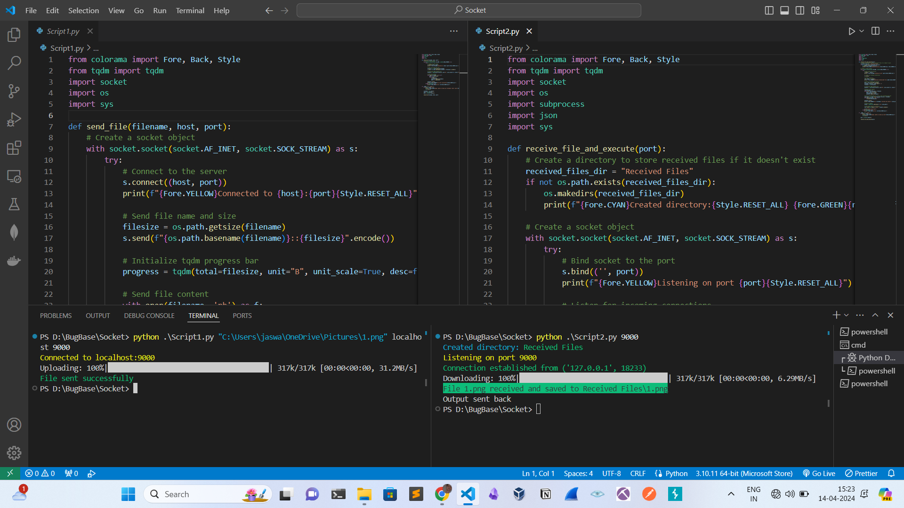
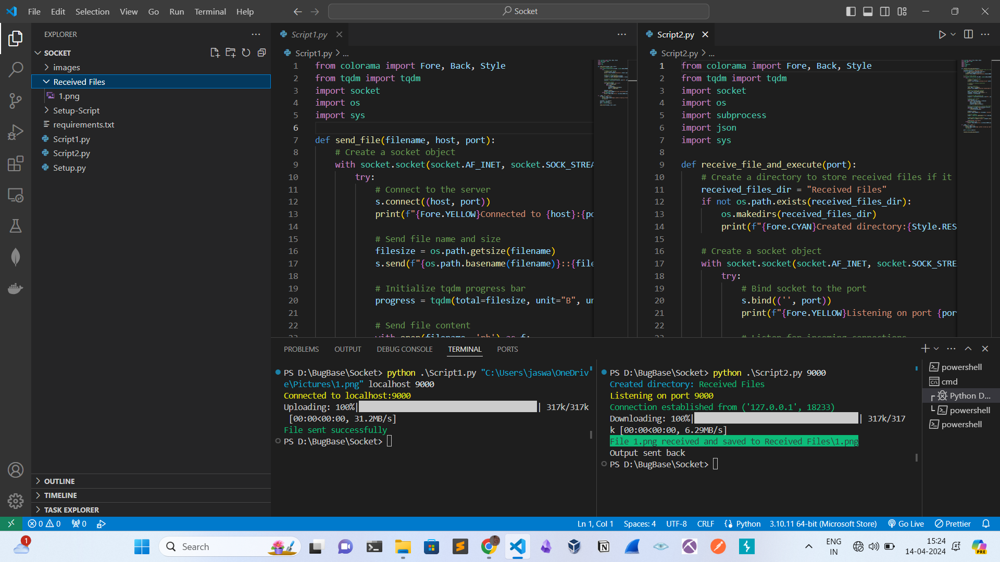
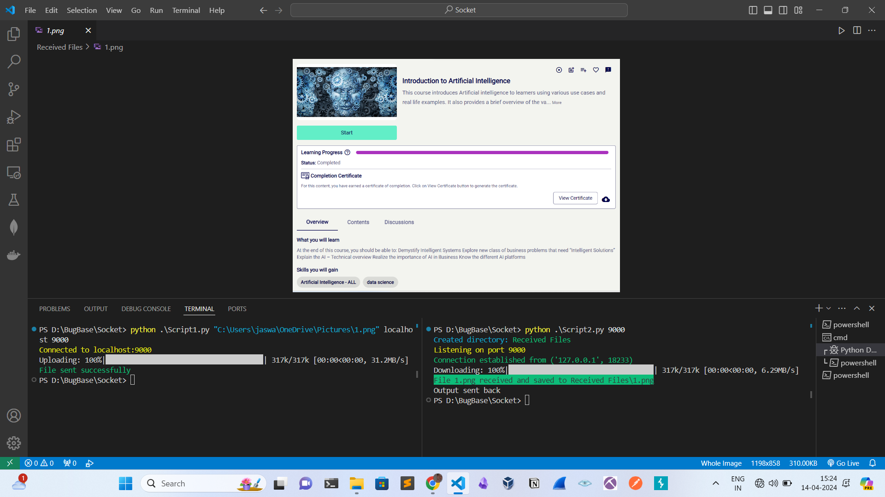

# BugBase-Socket-Programming

This project implements a simple file transfer and command execution system using Python socket programming. It consists of two scripts: `script1.py` and `script2.py`.

The project enables users to upload a file from one script to another over a network connection. The receiving script saves the uploaded file, executes a command on it (such as determining the file type), and sends the command output back to the sender.

This system is useful for scenarios where files need to be transferred and processed remotely, such as automated file processing or remote administration tasks. It serves as a learning exercise for understanding network communication and file handling in Python.

# File Transfer and Command Execution with Socket Programming

This project consists of two Python scripts, `script1.py` and `script2.py`, which enable file transfer and command execution over a network using socket programming.

## How it Works:

### script1.py:

**File Upload**: 
   - Establishes a connection to a server at a specified host and port.
   - Sends the name and size of the file to be transferred.
   - Sends the file content in chunks over the network using a socket connection.

### script2.py:

**File Reception and Command Execution**:
   - Listens for incoming connections on the specified port.
   - Receives the name and size of the file to be transferred.
   - Receives the file content in chunks over the network.
   - Saves the received file to a designated directory.
   - Executes a command on the received file (in this case, the `file` command to determine the file type).
   - Sends the command output back to the client.

## Installation

### Windows and Linux

1. **Clone the repository:**
   ```bash
   git clone https://github.com/Jaswanthravichandran/BugBase-Socket-Programming.git

2. **Navigate to the project directory:**
   ```bash
   cd BugBase-Socket-Programming

3. **Run the setup script:**
   ```bash
   python Setup.py

## Usage

1. Run the Script2.py first with the following command:
   ```bash
   python Script2.py <port>

2. Then run the Script1.py with the following command:
   ```bash
   python Script1.py <'filepath'> <host> <port>

## Usage Examples

[here](https://www.youtube.com/watch?v=VFvfjsXBnIM)







